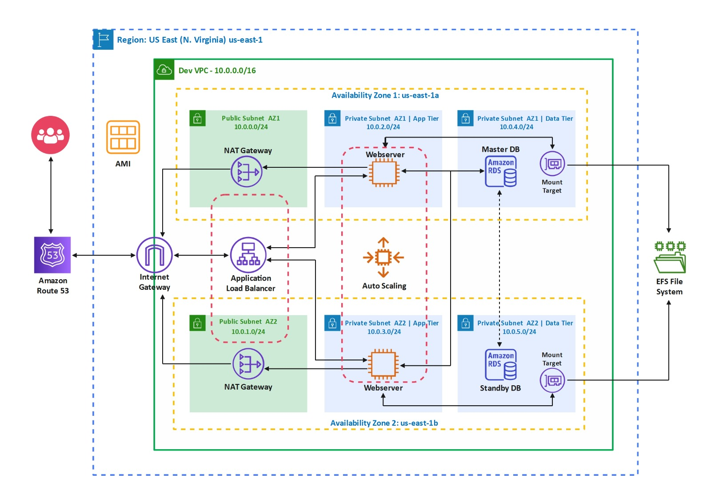

# **AWS-Powered WordPress Website Hosting**

Welcome to the AWS WordPress Website Hosting project! 🚀 In this project, we have showcased a guide of setting up a highly available and scalable WordPress website on Amazon Web Services (AWS). Below, you'll find detailed instructions for each part of the project.

## **Project Members**

- [Subhajit Panda](https://github.com/SubhajitPanda26)
- [Avidhan Purkait](https://github.com/AvidhanPurkait)

## **Table of Contents**

- [Introduction 🌟](#introduction-)
- [System Architecture Diagram 🚥](#system-architecture-diagram-)
- [Module 1: Building a Three-Tier AWS Network VPC… 🏗️](#module-1-building-a-three-tier-aws-network-vpc-%EF%B8%8F)
  - [VPC 🌐](#virtual-private-cloud-vpc)
  - [Internet Gateway 🌐](#internet-gateway-)
  - [Subnets 🌐](#subnets-)
- [Module 2: Creating NAT Gateways… 🛡️](#module-2-creating-nat-gateways-%EF%B8%8F)
- [Module 3: Creating Security Groups… 🔒](#module-3-creating-security-groups-)
- [Module 4: Creating RDS Instance… 🗃️](#module-4-creating-rds-instance-%EF%B8%8F)
- [Module 5: Creating Elastic File System (EFS)… 💾](#module-5-creating-elastic-file-system-efs-)
- [Module 6: Creating a Key Pair… 🔑](#module-6-creating-a-key-pair-)
- [Module 7: Creating and Launching Setup Server… 🚀](#module-7-creating-and-launching-setup-server-)
- [Module 8: SSH into an EC2 Instance in Public Subnet… 🌐](#module-8-ssh-into-an-ec2-instance-in-public-subnet-)
- [Module 9: Installing WordPress… 📦](#module-9-installing-wordpress-)
- [Module 10: Creating Application Load Balancer… ⚖️](#module-10-creating-application-load-balancer-%EF%B8%8F)
- [Module 11: Registering a Domain Name… 🌐](#module-11-registering-a-domain-name)
- [Module 12: Creating Record Set in Route 53… 📝](#module-12-creating-record-set-in-route-53-)
- [Module 13: Registering SSL Certificate in AWS Certificate Manager… 🔒](#module-13-registering-ssl-certificate-in-aws-certificate-manager-)
- [Module 14: Launching Bastion Host… 🚧](#module-14-launching-bastion-host-)
- [Module 15: SSH into an EC2 Instance in Private Subnet… 🌐](#module-15-ssh-into-an-ec2-instance-in-private-subnet-)
- [Module 16: Creating HTTPS Listener for Application Load Balancer… 🔒](#module-16-creating-https-listener-for-application-load-balancer-)
- [Module 17: Creating Auto Scaling Group… ⚙️](#module-17-creating-auto-scaling-group-%EF%B8%8F)
- [Module 18: Installing WordPress Theme and Template… 🎨](#module-18-installing-wordpress-theme-and-template-)

## **Introduction 🌟**

This project aims to deploy a WordPress website on AWS from scratch, leveraging various AWS services and incorporating a robust three-tier network architecture to ensure high availability, security, and scalability.

Before starting our project, we have ensured that the following items have been made available beforehand:

- An AWS account with the necessary permissions.
- A domain name for our WordPress site (for our case, **projectearth.site**).

## **System Architecture Diagram 🚥**

### **Let's get started with the project modules:**

## **Module 1: Building a Three-Tier AWS Network VPC… 🏗️**

In the context of our AWS WordPress Hosting project, creating a 3-tier reference architecture is essential for ensuring the scalability, security, and performance of the WordPress website. Each tier serves a distinct purpose, contributing to the overall reliability and robustness of the architecture.

### **Web Tier (Public Subnet) 🌐**

- **Purpose:** The Web Tier, placed in a public subnet, is responsible for handling incoming HTTP/HTTPS traffic from the internet. It serves as the entry point to our WordPress site, allowing visitors to access the content.

- **Key Functions:**

  - NAT Gateway, Load Balancer, and Bastion Host will be launched in public subnets.

### **Application Tier (Private Subnet) 🚀**

- **Purpose:** The Application Tier, located in a private subnet, hosts the core components of the WordPress application. It processes dynamic requests, interacts with the database, and executes application logic.
- **Key Functions:**

  - Communicates securely with the Database Tier.
  - Runs PHP scripts and handles WordPress core functionality.
  - Executes server-side code for WordPress plugins and themes.

### **Database Tier (Private Subnet) 🗃️**

- **Purpose:** The Database Tier, also in a private subnet, stores WordPress site's data, including posts, user information, and configurations. It ensures data consistency, durability, and scalability.
- **Key Functions:**

  - Provides data access for the Application Tier.
  - Stores WordPress database tables and performs automatic backups and maintains data integrity.

To ensure high availability, we will replicate these subnets across multiple availability zones (2 in this project). Additionally, we need to establish an internet gateway and configure a route table to enable internet connectivity for the resources within our VPC.

## Virtual Private Cloud (VPC)🌐

The Virtual Private Cloud (VPC) provides a controlled, isolated environment for our resources, ensuring that the WordPress site operates securely. It allows us to define our own network topology, IP address range, and subnets.

✅ **STEPS** ✅

⏩ Log in to the **AWS Management Console** and navigate to the **VPC dashboard \> Create VPC**.

⏩ Select **VPC only** and enter 10.0.0.0/16 in the **IPv4 CIDR block** manually.

⏩ Keep everything else as default and click **Create VPC**.

⏩ In the **VPC dashboard**, select the created VPC and go to the **Actions** **\>** **Edit VPC Settings** and save after checking the **Enable DNS hostnames**.

## Internet Gateway 🌐

An Internet Gateway is a network component that enables communication between a private network, such as a local area network (LAN), and the Internet.

Set up an Internet Gateway to enable bidirectional communication between the Virtual Private Cloud (VPC) and the Internet, granting external users access to our WordPress site and ensuring its online accessibility.

✅ **STEPS** ✅

⏩ In the VPC dashboard, select **Internet Gateways \> Create Internet Gateway**

⏩ After creating Internet Gateway, click on **Attach to a VPC**.

⏩ Select the created VPC and click on **Attach internet gateway**.

## Subnets 🌐

Subnets are network segments within a larger IP network, typically associated with a specific availability zone, used to manage and organize IP addresses and resources within the VPC. Configure public and private subnets within the VPC.

🔷 **_Public Subnets:_** Public subnets are used for resources that need direct internet access, such as the load balancer.

✅ **STEPS** ✅

⏩ In the VPC dashboard, select **Subnets \> Create Subnet**.

⏩ Create the 1st Public Subnet.

- **Subnet Name -** Public Subnet AZ1
- **VPC ID -** Select the created VPC
- **Availability Zone -** us-east-1a
- **IPv4 CIDR block -** 10.0.0.0/24

⏩ Similarly, create the 2nd Public Subnet.

- **Subnet Name -** Public Subnet AZ2
- **VPC ID -** Select the created VPC
- **Availability Zone -** us-east-1b
- **IPv4 CIDR block -** 10.0.1.0/24

⏩ Select **Public Subnet AZ1 \> Actions \> Edit Subnet Settings \> Auto-assign IP settings.**

⏩ Check the **Enable auto-assign public IPv4 address**.

⏩ Perform the same actions for **Public Subnet AZ2**.

⏩ Create a Public Route Table from **VPC dashboard \> Route Tables \> Create route table**.

⏩ Under Routes tab click **Edit routes \> Add route** and add the following,

- **Destination -** 0.0.0.0/0
- **Target –** Internet gateway

⏩ Next beside the **Routes** tab click **Subnet associations \> Edit subnet associations** and select both the **Public Subnets** and save it.

🔷 **_Private Subnets:_** Private subnets enhance security by isolating sensitive resources like the database.

✅ **STEPS** ✅

⏩ In the VPC dashboard, select **Subnets \> Create Subnet**.

⏩ Create the 1st Private Subnet.

- **Subnet Name –** Private Subnet AZ1 \| App Tier
- **VPC ID -** Select the created VPC
- **Availability Zone -** us-east-1a
- **IPv4 CIDR block -** 10.0.2.0/24

⏩ Similarly, create the 2nd Private Subnet.

- **Subnet Name –** Private Subnet AZ2 \| App Tier
- **VPC ID -** Select the created VPC
- **Availability Zone -** us-east-1b
- **IPv4 CIDR block -** 10.0.3.0/24

⏩ Similarly, create the 3rd Private Subnet.

- **Subnet Name –** Private Subnet AZ1 \| DB Tier
- **VPC ID -** Select the created VPC
- **Availability Zone -** us-east-1a
- **IPv4 CIDR block -** 10.0.4.0/24

⏩ Similarly, create the 4th Private Subnet.

- **Subnet Name –** Private Subnet AZ2 \| DB Tier
- **VPC ID -** Select the created VPC
- **Availability Zone -** us-east-1b
- **IPv4 CIDR block -** 10.0.5.0/24

## **Module 2: Creating NAT Gateways… 🛡️**

Network Address Translation (NAT) gateways provide instances in private subnets with the ability to access the internet while remaining protected from inbound traffic initiated from the internet. This ensures that the WordPress instances in private subnets can fetch updates and plugins securely. Two NAT gateways will be created in the first and second public subnets for both availability zones.

✅ **STEPS** ✅

⏩In the VPC dashboard, select **NAT Gateways \> Create NAT Gateway** and also allocate Elastic IP with it.

⏩Create a Private Route Table from **VPC dashboard \> Route tables \> Create route table**.

⏩Under Routes tab click **Edit routes \> Add route** and add the following,

- **Destination -** 0.0.0.0/0
- **Target -** NAT gateway from AZ1

⏩Next beside the **Routes** tab click **Subnet associations \> Edit subnet associations** and select the **Private Subnets** from **AZ1** and save it.

Similarly, create the second **NAT gateway** in the **Public Subnet AZ2** by following the above **Steps 1-5**.

## **Module 3: Creating Security Groups… 🔒**

Security groups act as virtual firewalls for our instances, controlling inbound and outbound traffic. Also, security groups enhance the security of our WordPress site by allowing only necessary traffic while blocking potential threats.

✅ **STEPS** ✅

⏩Navigate to **VPC dashboard \> Security Groups** **\> Create Security Group.**

⏩Create the following security groups with the associated **Inbound Rules.**

### 🔳 **ALB Security Group:**

**Reason:** This security group controls traffic to and from the Application Load Balancer (ALB), ensuring that only necessary connections are allowed.

**Inbound Rules:**

- **Type** **-** HTTP, **Source -** 0.0.0.0/0
- **Type -** HTTPS, **Source -** 0.0.0.0/0

### 🔳 **SSH Security Group:**

**Reason:** The SSH security group is essential for securing SSH access to the EC2 instances. It restricts SSH access to authorized users and IP addresses.

**Inbound Rules:**

- **Type** **-** SSH, **Source -** My IP

### 🔳 **Webserver Security Group:**

**Reason:** This security group is associated with the web servers and ensures that only web-related traffic is allowed to reach them.

**Inbound Rules:**

- **Type** **-** HTTP, **Source -** ALB Security Group
- **Type -** HTTPS, **Source -** ALB Security Group
- **Type -** SSH, **Source -** SSH Security Group

### 🔳 **Database Security Group:**

**Reason:** The Database Security Group is responsible for controlling access to RDS instance, protecting the database from unauthorized access.

**Inbound Rules:**

- **Type** **-** MYSQL/Aurora, **Source -** Webserver Security Group

### 🔳 **EFS Security Group:**

**Reason:** This security group controls access to Elastic File System (EFS), ensuring that only authorized instances can mount the file system.

**Inbound Rules:**

- **Type** **-** NFS, **Source -** Webserver Security Group
- **Type -** SSH, **Source -** Webserver Security Group
- **Type** **-** NFS, **Source -** EFS Security Group **(After creating the EFS Security Group)**

## **Module 4: Creating RDS Instance… 🗃️**

Launch a Relational Database Service (RDS) instance to store WordPress data securely. It provides managed database services, ensuring data durability, scalability, and automated backups.

✅ **STEPS** ✅

⏩ In the RDS dashboard, select **Subnet groups \> Create DB Subnet group**.

⏩ Under **Add subnets**, enter the following,

- **Availability Zones -** us-east-1a and us-east-1b
- **Subnets -** Subnet with CIDR block 10.0.4.0/24 and 10.0.5.0/24

⏩ Now, to create database, select **Database \> Create database** and enter the following,

- **Database creation method -** Standard create
- **Engine options -** MySQL
- **Engine version -** MySQL 5.7.37
- **Templates -** Free tier
- **DB instance class -** Burstable classes (included t classes) and select **db.t2.micro**
- **VPC security group (firewall) -** Choose existing
- **Existing VPC security groups -** Database Security Group
- **Availability Zones -** us-east-1a
- **Additional configuration -** Give **Initial database name**

## **Module 5: Creating Elastic File System (EFS)… 💾**

Set up an Elastic File System (EFS) as it serves as shared storage for the WordPress instances. This shared storage allows multiple instances to access and share files, ensuring consistent content across our site while simplifying data management. The Elastic File System (EFS) will enable the web servers located in the private app subnets to access and retrieve application code and configuration files from the shared location.

✅ **STEPS** ✅

⏩ From **management console,** navigate to **Elastic File System \> Create file system**.

⏩ Under **Mount targets** add,

1.  **Availability zone** – us-east-1a, **Subnet ID** - Private Subnet AZ1 \| DB Tier, **Security Groups** – EFS SG

2.  **Availability zone** – us-east-1b, **Subnet ID** - Private Subnet AZ2 \| DB Tier, **Security Groups** – EFS SG

⏩ After successfully creating EFS, click the **File system ID \> Attach.** In this tab, we can find the information about mounting the file system.

## **Module 6: Creating a Key Pair… 🔑**

Generate an SSH key pair to securely access the instances. They provide an additional layer of authentication and encryption, safeguarding our WordPress environment from unauthorized access.

✅ **STEPS** ✅

⏩ In the **EC2 dashboard**, navigate to **Key Pairs \> Create Key Pair** and save the private key file.

## **Module 7: Creating and Launching Setup Server… 🚀**

The creation and launch of the setup server act as the initial platform for configuring our WordPress environment and performing essential setup tasks.

✅ **STEPS** ✅

⏩ Go to the **EC2 dashboard**, click “**Launch Instance**”.

⏩ Configure the instance details, add storage, configure security groups etc. and launch the instance.

## **Module 8: SSH into an EC2 Instance in Public Subnet… 🌐**

Secure Shell (SSH) access to EC2 instances in the public subnet allows us to perform administrative tasks, updates, and installations on the servers. This ensures that our WordPress instances are properly configured and maintained.

✅ **STEPS** ✅

⏩ Copy the IPv4 address from the setup server.

⏩ Download and Open **Putty** software.

⏩ In Putty, Under **Session \> Host Name** and enter **ec2-user**\@_IPv4_.

⏩ Click **Connection \> SSH \> Auth \> Credentials** and **Browse** for the saved private key for **Private key file for authentication** and click **Open**.

## **Module 9: Installing WordPress… 📦**

Next, we will install and configure WordPress on the EC2 instances.

✅ **STEPS** ✅

⏩ On the terminal, enter the following commands replacing the highlighted text with **EFS \> EFS ID \> Attach \> Using the NFS client** -

⏩ In nano editor, replace and save the **DB_NAME, DB_USER, DB_PASSWORD** from **Amazon RDS \> Databases \> DB identifier \> Configuration** tab and **DB_HOST** from **Connectivity & security \> Endpoint**.

⏩ Lastly, we will restart the web server by,

⏩ Now, copy the **Public IPv4 address** from **EC2 dashboard** and open it in a new tab.

⏩ Register a new Wordpress account by providing necessary informations.

## **Module 10: Creating Application Load Balancer… ⚖️**

Set up an Application Load Balancer (ALB) to distribute traffic across multiple WordPress instances, improving our site's availability and fault tolerance. It also enhances performance by evenly spreading the load among our WordPress servers.

✅ **STEPS** ✅

⏩ In the EC2 dashboard, select **Launch instance** and add the following,

- **Name -** Webserver AZ1
- **AMI -** Amazon Linux 2 AMI
- **Instance type -** t2.micro
- **Key pair -** select the created keypair
- **Subnet -** Private Subnet AZ1 \| App Tier
- **Security groups -** Webserver Security Group
- **User data -** paste the following commands with updated EFS information

⏩ Similarly launch another instance in **Private Subnet AZ2 \| App Tier.**

⏩ Now, create Target group by selecting **EC2 dashboard \> Target Groups** and add the following,

- **Target type -** Instances
- **Success codes -** 200, 301, 302

⏩ Click **Next \>** select **Webserver AZ1** and **Webserver AZ2 \>** click **Include as pending below \> Create target group.**

⏩ Now, create **Application Load Balancer** by selecting **Load Balancers \> Create load balancer \> Application Load Balancer** and enter the following data,

- **Mappings -** Public Subnet AZ1 in **us-east-1a** and Public Subnet AZ2 in **us-east-1b**
- **Security groups -** deselect default and select **ALB Security Group**
- **Listener -** Select the created Target group

⏩ Now, copy **DNS name** of the ALB and log in to **Wordpress dashboard \> Settings \> General** and paste the **DNS name** in **Wordpress Address** and **Site Address** and **Save.**

⏩ Terminate the Setup Server.

## **Module 11: Registering a Domain Name…🌐**

Register a domain name for the WordPress site for making it accessible to users worldwide.

✅ **STEPS** ✅

⏩ Purchase a domain in **hostinger.com**

## **Module 12: Creating Record Set in Route 53… 📝**

Creating a record set in Route 53 associates our domain name with the ALB's DNS address. It directs traffic from our domain to the WordPress site hosted on AWS, ensuring that users reach the desired site when they enter the domain in their browsers.

✅ **STEPS** ✅

⏩ In the Route53 dashboard, select **Hosted Zones \> Create Hosted Zone** and add the domain name.

⏩ Now, in **Hosted zones**, select the domain and click **Create record** and enter the following,

- **Record name -** www
- **Enable Alias** and **Route traffic to -** Alias to Application and Classic Load Balancer, US East (N. Virginia) and select the created load balancer
- Copy the Record **Values** and paste in the **Nameservers** of the domain in Hostinger.

⏩ Copy the domain name and log in to **Wordpress dashboard \> Settings \> General** and paste it in **Wordpress Address** and **Site Address** and **Save.**

## **Module 13: Registering SSL Certificate in AWS Certificate Manager… 🔒**

Registering for an SSL certificate from AWS Certificate Manager adds a layer of security to our site by enabling encrypted HTTPS connections. It helps protect user data and builds trust among the site's visitors.

✅ **STEPS** ✅

⏩ In **AWS Certificate Manager,** click **Request a certificate** and add the following,

- **Certificate type -** Request a public certificate
- **Domain names -** Give the domain name

⏩ Now, click **View certificate \> Create records in Route 53 \>** select **Domain names \> Create records.**

## **Module 14: Launching Bastion Host… 🚧**

Create a bastion host as it serves as a secure gateway for accessing instances in private subnets. It provides an additional layer of security and ensures that we can maintain and troubleshoot the WordPress environment efficiently.

✅ **STEPS** ✅

⏩ Launch an EC2 instance in the Public Subnet AZ1 and configure security groups to allow SSH access.

## **Module 15: SSH into an EC2 Instance in Private Subnet… 🌐**

SSH access to private instances through the bastion host allows us to manage sensitive resources securely. This setup minimizes exposure to potential threats while providing essential access for administration.

✅ **STEPS** ✅

⏩ Download & Open **puttygen** software.

⏩ **Load** the saved private key and add a **Key passphrase** and click **Save private key**.

⏩ Download & Open **pageant** software.

⏩ Select the saved modified private key by clicking **Add Key** and entering **Key passphrase**.

⏩ Now, firstly copy the **Public IPv4 address** of Bastion Host and then open **putty** software and under **Session \> Host Name**, enter **ec2-user**\@_IPv4_.

⏩ Under **SSH \> Auth**, enable **Allow agent forwarding**.

⏩ Hit **Open** and then **Accept** and we will be successfully logged into the Bastion Host.

⏩ To SSH into the EC2 instance of private subnet, paste the command **ssh ec2-user**\@_Private IPv4 address of Webserver AZ1_ in the terminal.

## **Module 16: Creating HTTPS Listener for Application Load Balancer… 🔒**

Configuring an HTTPS listener on the ALB ensures that our WordPress site is accessible via secure, encrypted connections.

✅ **STEPS** ✅

⏩ Navigate to **EC2 \> Load balancers \> Name** and under **Listeners and rules** tab click **Add listener**.

⏩ Add a listener with following details,

- **Protocol : Port** - HTTPS : 443
- **Forward to target group** - PROJ-TG
- **Default SSL/TLS certificate** - projectearth.site

⏩ To re-direct the HTTP traffics to HTTPS, goto **Listeners and rules** tab navigate **HTTP:80 \> Actions \> Edit listener**,

- **Action types** - Redirect to URL
- **Protocol : Port** - HTTPS : 443

⏩ On the putty terminal, enter the command **nano /var/www/html/wp-config.php** and paste the following command inside the text editor (at the top).

⏩ Next, goto **projectearth.site/wp-admin** and navigate to **Dashboard \> Settings \> General** and update,

## **Module 17: Creating Auto Scaling Group… ⚙️**

An Auto Scaling Group ensures that our WordPress site can handle varying levels of traffic. It automatically adjusts the number of instances based on traffic demands, ensuring our site remains responsive and available during traffic spikes.

✅ **STEPS** ✅

⏩ In EC2 Dashboard, terminate the instances other than the **Bastion Host.**

⏩ Select **Launch Templates \> Create launch template** and add the following,

- Enable the **Auto Scaling guidance**

- **Application and OS Images -** Amazon Linux 2 AMI
- **Instance type -** t2.micro
- **Key pair -** Select the keypair
- **Security groups -** Webserver Security Group

- **User data -** give commands with updated EFS information

⏩ Now, select **Auto Scaling \> Create Auto Scaling group** and enter the following,

- **Launch template -** select the created template
- **Availability Zones and subnets -** Private Subnet AZ1 \| App Tier, Private Subnet AZ2 \| App Tier
- **Load balancing -** Attach to an existing load balancer
- **Existing load balancer target groups -** select the created target group
- Enable **Turn on Elatic Load Balancing health checks** and **Enable group metrics collection within Cloudwatch.**
- Under Group Size, **Desired capacity -** 2, **Maximum capacity –** 4

## **Module 18: Installing WordPress Theme and Template… 🎨**

Customize WordPress site with themes and templates.

✅ **STEPS** ✅

1.  Log in to WordPress admin dashboard.
2.  Install and activate desired theme and template.

